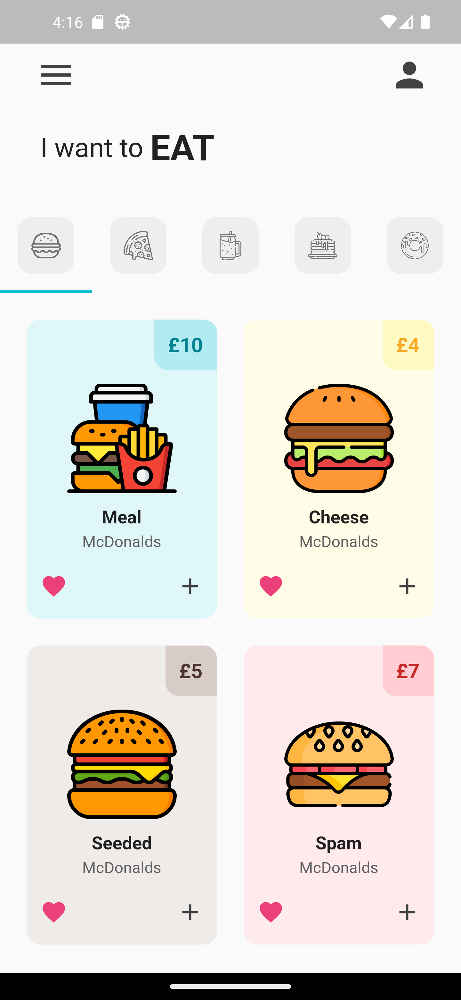
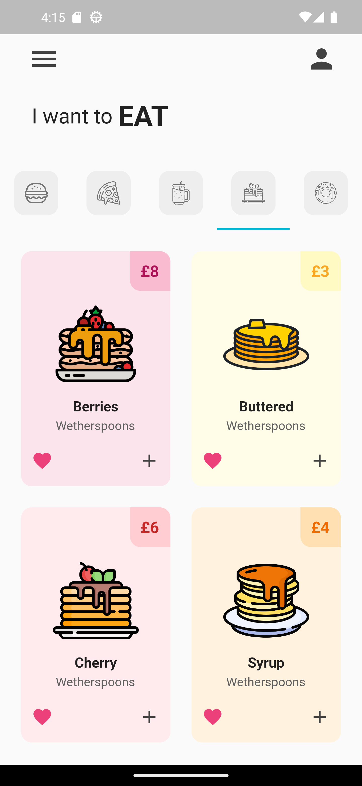
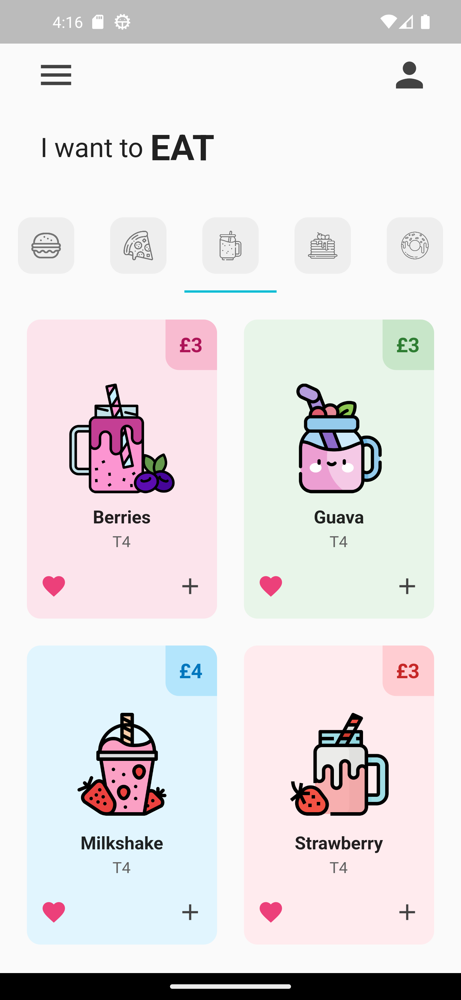

# Flutter Food Shop

    
    
    

This program is to test flutter and dart, testing out a basic food shop UI.

# Contribution 

If you'd like to contribute to `flutter_food_shop` please submit a pull-request on a feature branch.

# Installing

Clone the repo:

    git clone https://github.com/Sommos/flutter_food_shop
    cd flutter_food_shop
